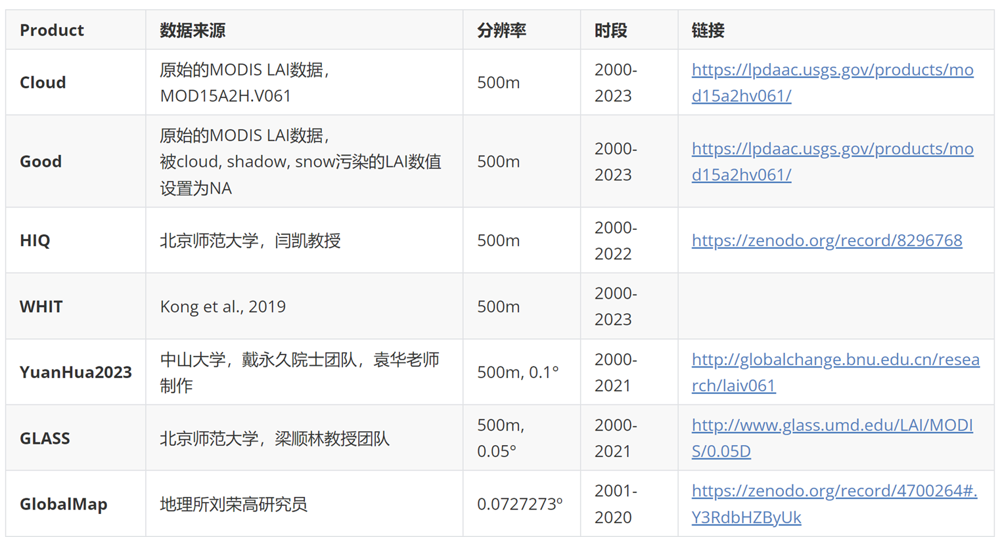
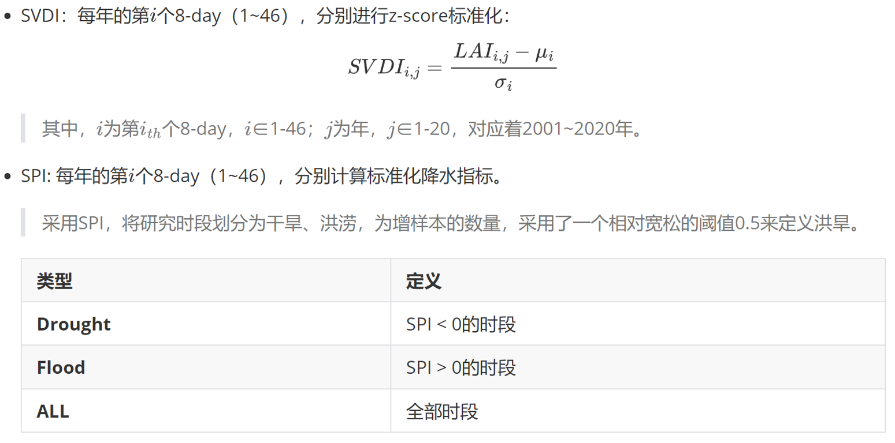
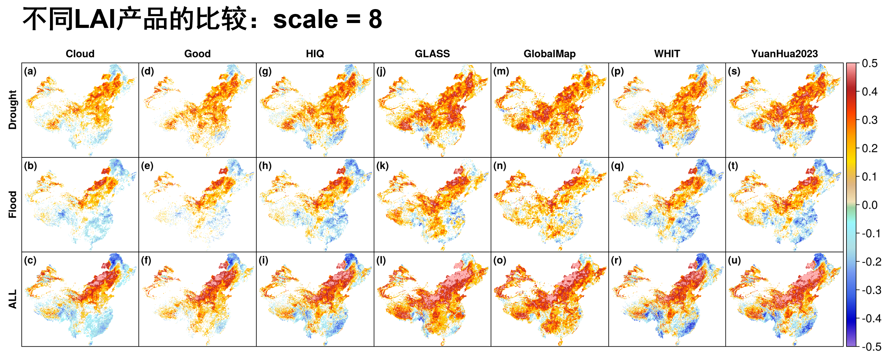
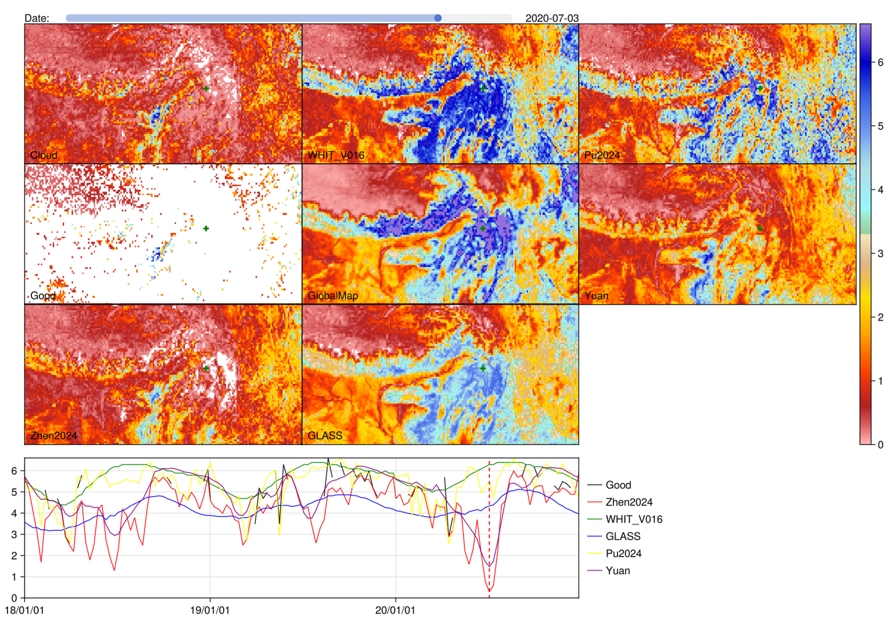
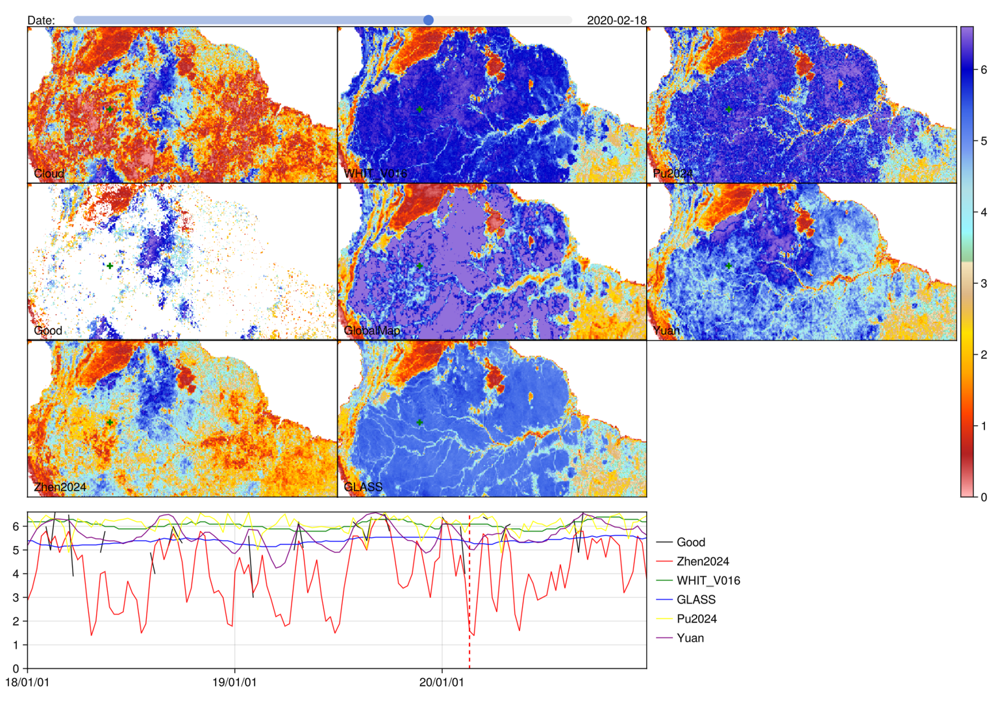
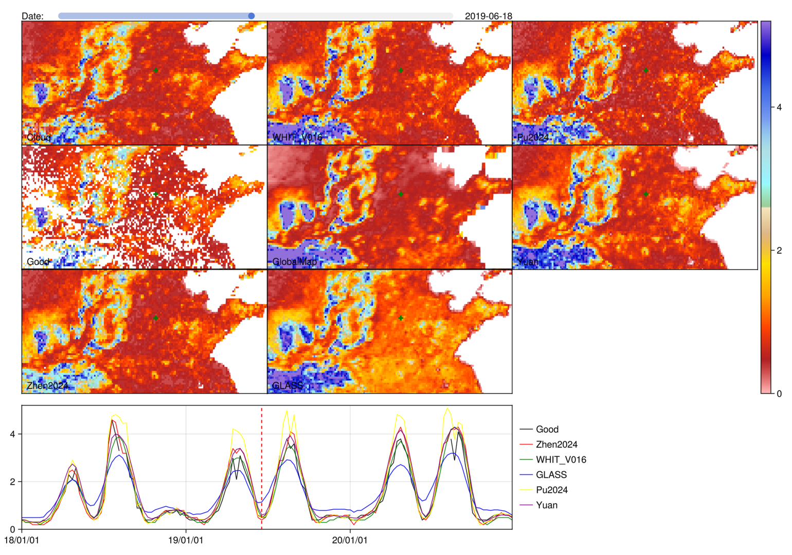
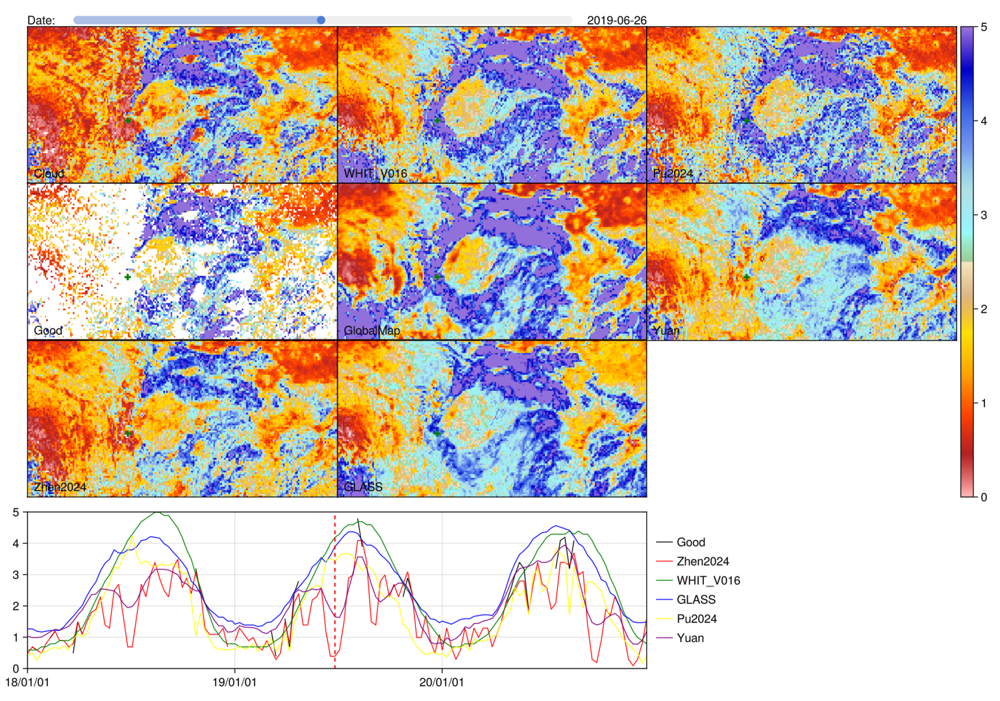

# GEE Whittaker Smoothed LAI (2000-2024)

## Highlights

- 保护双生长季信号

- 保护干旱响应信号

- EBF质量提升

## 数据
- **500m, 8-day, 2000-2024**

  https://code.earthengine.google.com/?asset=projects/gee-hydro/MODIS_Terra_LAI/MOD15A2H_V061_LAI_whittaker_v16

  ```js
  var col = ee.ImageCollection('projects/gee-hydro/MODIS_Terra_LAI/MOD15A2H_V061_LAI_whittaker_v16');
  ```
  全球被划分成了3*5 tiles, 需使用下面的代码进行拼接：[LAI_WHITV016.js](./LAI_WHITV016.js)。

- **0.1deg, 8-day, 2000-2024**

  稍后上传

## Reference

> [1] Kong, D., Zhang, Y.\*, Gu, X., & Wang, D. (2019). A robust method
> for reconstructing global MODIS EVI time series on the Google Earth
> Engine. __*ISPRS Journal of Photogrammetry and Remote Sensing*__, 155,
> 13–24.
>
> [2] Kong, D., McVicar, T. R., Xiao, M., Zhang, Y., Peña-Arancibia, J. L., Filippa, G., Xie, Y., Gu, X. (2022). phenofit: An R package for extracting vegetation phenology from time series remote sensing. __*Methods in Ecology and Evolution*__, 13, 1508-1527. <https://doi.org/10.1111/2041-210X.13870>

## 效果展示



### 洪旱响应





### 喜马拉雅



### 亚马逊



### 华北双生长季



### 四川盆地


