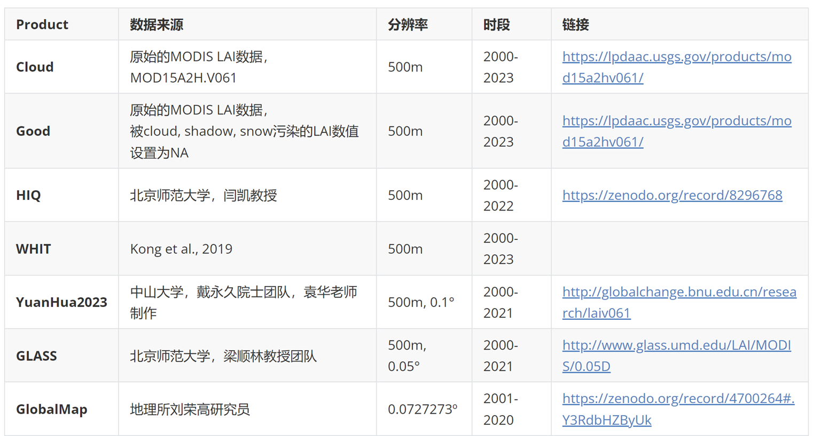
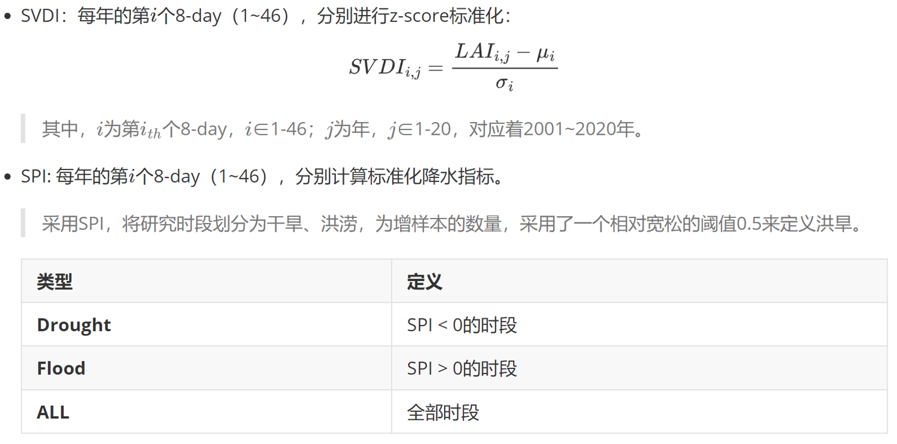
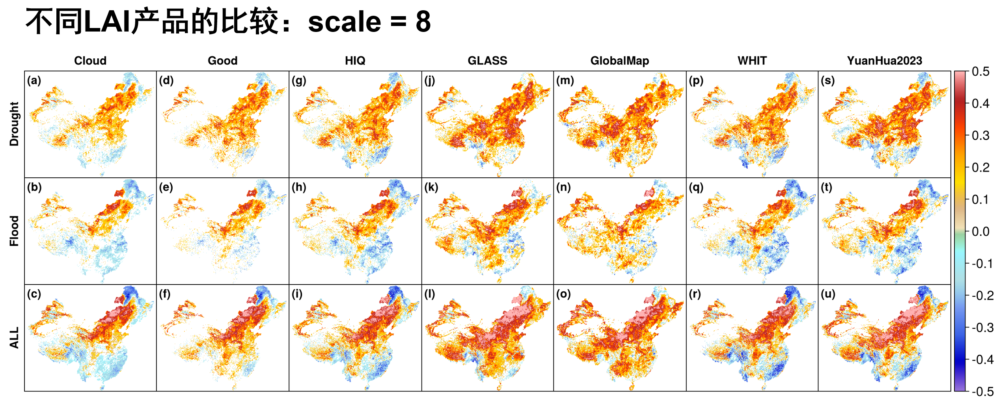
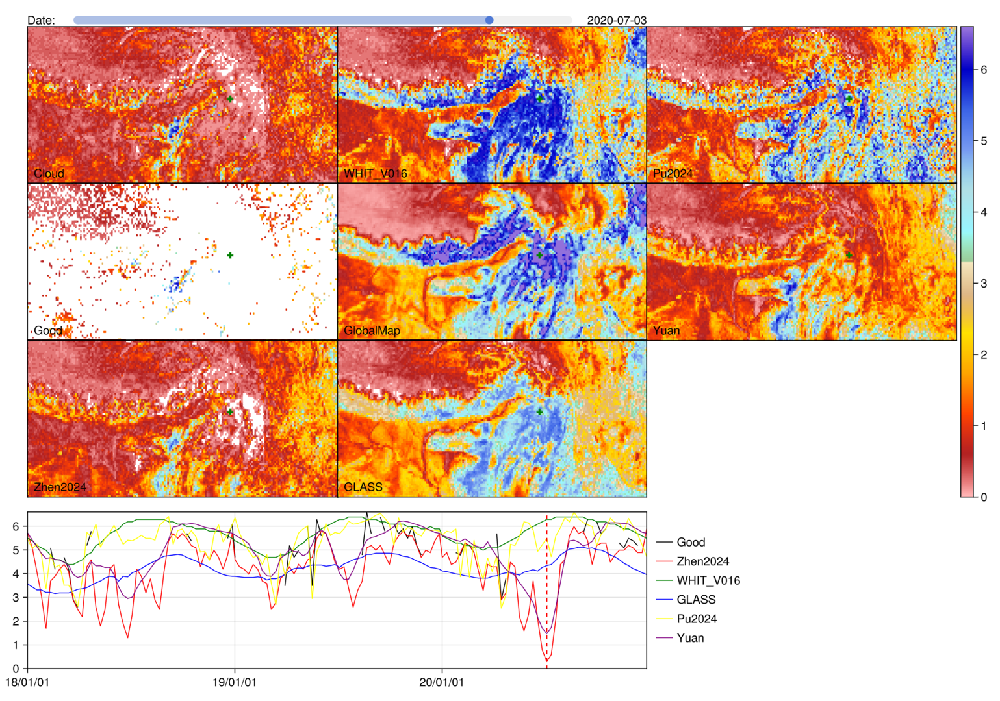
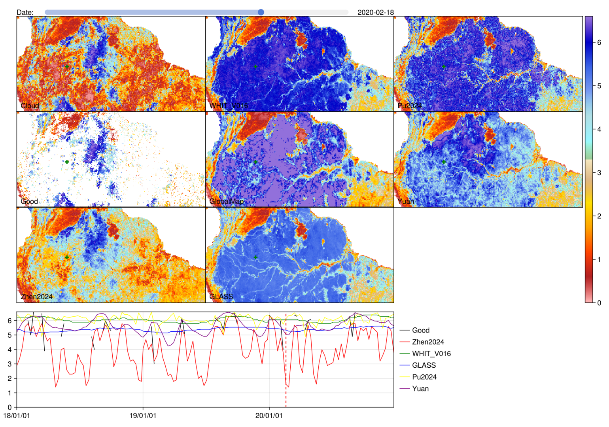
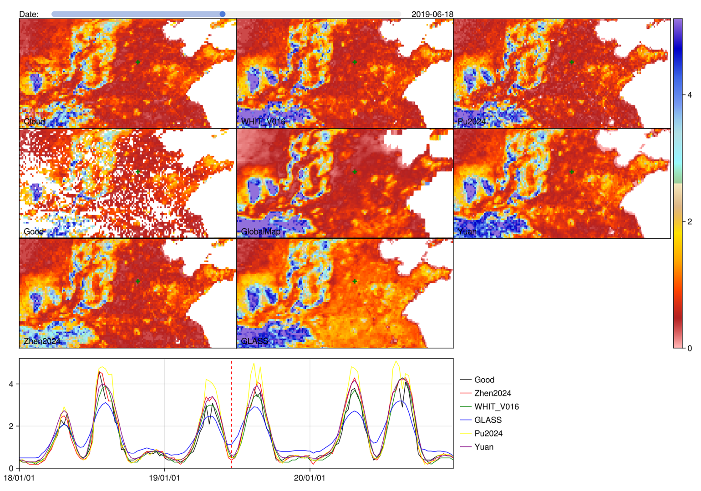
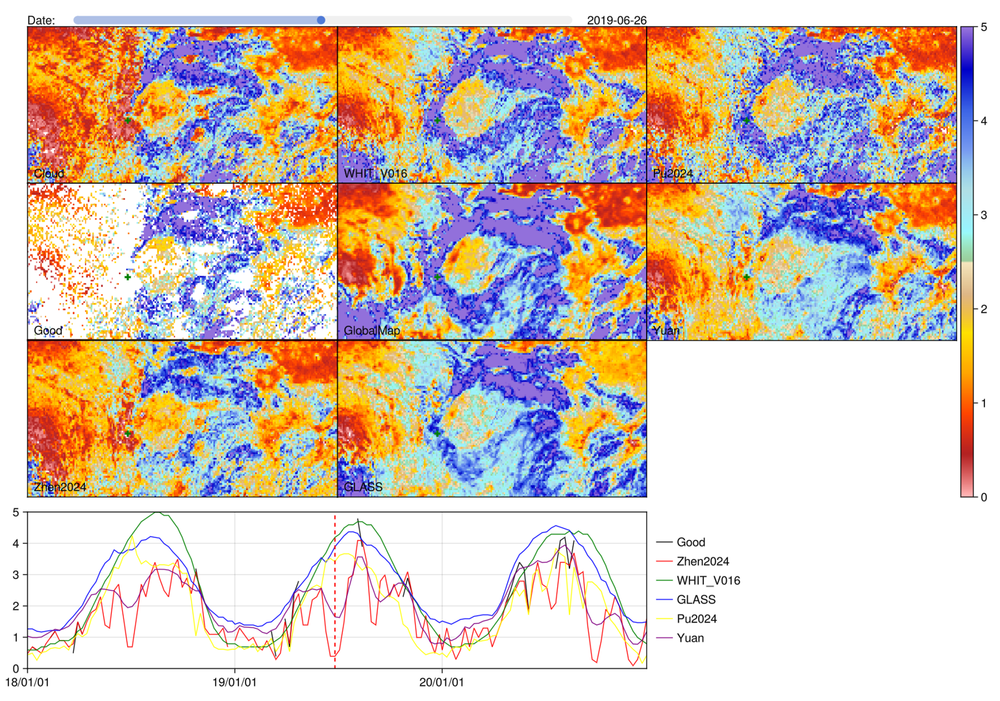

# GEE Whittaker Smoothed LAI (2000-2025)

- MODIS LAI 2000-2025, [MODIS_LAI_WHITV016.js](MODIS_LAI_WHITV016.js), (update 2026-01-11)
- VIIRS LAI 2020-2025, [VIIRS_LAI_WHITV001.js](VIIRS_LAI_WHITV001.js), (update 2026-03-08)

> 2022.10之后MODIS LAI存在显著轨道漂移，MODIS LAI无法继续使用。

### VIIRS Costs (v2026-03-08)

| Task                   | EECU-Seconds       |      | Task                   | EECU-Seconds       |
| ---------------------- | ------------------ | ---- | ---------------------- | ------------------ |
| LAI_8day_2020_2025_1_0 | **5,091,763.5000** |      | LAI_8day_2020_2025_0_0 | **4,148,185.2500** |
| LAI_8day_2020_2025_1_1 | **7,004,491.0000** |      | LAI_8day_2020_2025_0_1 | **6,204,074.5000** |
| LAI_8day_2020_2025_1_2 | **5,411,984.5000** |      | LAI_8day_2020_2025_0_2 | **5,759,838.0000** |
| LAI_8day_2020_2025_1_3 | **7,172,942.0000** |      | LAI_8day_2020_2025_0_3 | **5,287,771.5000** |
| LAI_8day_2020_2025_1_4 | **5,265,798.0000** |      | LAI_8day_2020_2025_0_4 | **4,585,453.5000** |

共计**15,536.75** EE-Hours，5550$！。

https://cloud.google.com/earth-engine/pricing

| 折扣层级 |                阈值                | 分级价格 |
| :------: | :--------------------------------: | :------: |
|  层级 1  |     消耗 0 到 10,000 EECU 小时     |  $0.40   |
|  层级 2  | 消耗了 10,000 到 500,000 EECU 小时 |  $0.28   |
|  层级 3  |      500,000 EECU 小时及以上       |  $0.16   |

## Highlights

- 保护双生长季信号

- 保护干旱响应信号

- EBF质量提升

## 数据
- **500m, 8-day, 2000-2025**

  https://code.earthengine.google.com/?asset=projects/gee-hydro/MODIS_Terra_LAI/MOD15A2H_V061_LAI_whittaker_v16

  ```js
  var col = ee.ImageCollection('projects/gee-hydro/MODIS_Terra_LAI/MOD15A2H_V061_LAI_whittaker_v16');
  ```
  全球被划分成了3*5 tiles, 需使用下面的代码进行拼接：[MODIS_LAI_WHITV016.js](MODIS_LAI_WHITV016.js)。

- **0.1deg, 8-day, 2000-2025**

  稍后上传

## Reference

> [1] Kong, D., Zhang, Y.\*, Gu, X., & Wang, D. (2019). A robust method
> for reconstructing global MODIS EVI time series on the Google Earth
> Engine. __*ISPRS Journal of Photogrammetry and Remote Sensing*__, 155,
> 13–24.
>
> [2] Kong, D., McVicar, T. R., Xiao, M., Zhang, Y., Peña-Arancibia, J. L., Filippa, G., Xie, Y., Gu, X. (2022). phenofit: An R package for extracting vegetation phenology from time series remote sensing. __*Methods in Ecology and Evolution*__, 13, 1508-1527. <https://doi.org/10.1111/2041-210X.13870>

## 效果展示



### 洪旱响应





### 喜马拉雅



### 亚马逊



### 华北双生长季



### 四川盆地


